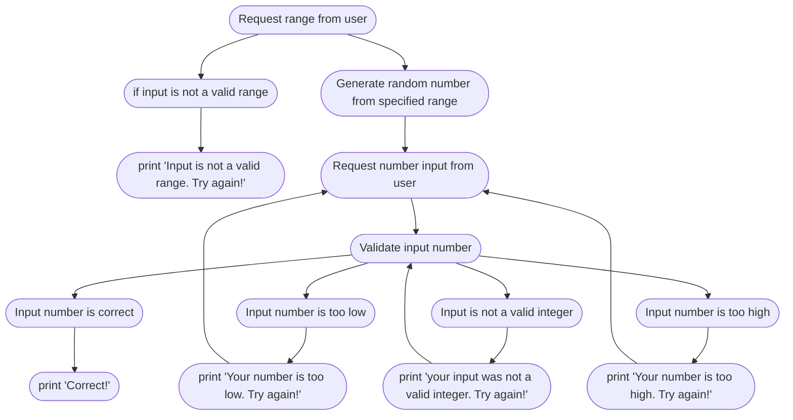

# Number Guessing Game
- This program is a simple game based on a very simple concept. The computer will generate a number based upon a range provided by the player, and it is the players goal to guess that number. 
- If the player guesses too high or too low, the program will tell them as such, and allow them to guess again
- If the player inputs an invalid range or guess, the program will request that they try again

